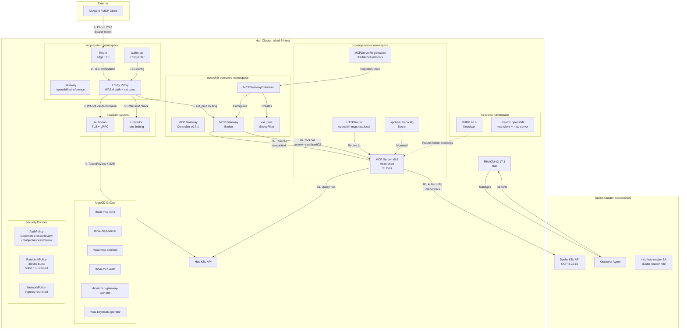

# RHOAI 3.5 -- GitOps Deployment

Deploy Red Hat OpenShift AI **3.5** on OpenShift using the official Helm chart,
managed entirely through OpenShift GitOps (ArgoCD).

| | Details |
|---|---|
| **RHOAI version** | 3.5 (chart v3.5.0) |
| **Chart source** | `oci://registry.redhat.io/rhai/rhai-on-openshift-chart:v3.5` |
| **OCP requirement** | 4.19+ |
| **Repo** | `https://github.com/rrbanda/ai-platforms.git` (branch: `main`) |

---

## Architecture

```
oc apply -f base/app-of-apps.yaml
    |
    +-- Wave 0: Prerequisite operators
    |       Service Mesh 3.x + MCP Gateway operator
    |
    +-- Wave 1: RHOAI platform (Helm chart)
    |       RHOAI operator + DSC with 17 components + Gateways
    |
    +-- Wave 2: Cluster config
    |       Dashboard features, EvalHub, MLflow, NemoGuardrails,
    |       MaaS PostgreSQL, MCP Gateway, vector stores
    |
    +-- Wave 3: Application workloads
    |       OGXServer + Milvus + DSPA (AutoRAG stack)
    |
    +-- Wave 4: MCP Infrastructure
    |       Namespaces, Gateway, MCPServer, MCPGatewayExtension, Route
    |
    +-- Wave 5: MCP Connect
    |       HTTPRoute, MCPServerRegistration, broker credentials
    |
    +-- Wave 6: MCP Auth (production multi-tenant)
    |       AuthPolicy, RateLimitPolicy, NetworkPolicy, Authorino TLS
    |
    +-- Wave 7: MCP Guardrails (TP)
            NeMo Guardrails config, BBR payload-processing
```

### ArgoCD Applications

| Wave | App | Project | Source |
|------|-----|---------|--------|
| 0 | `rhoai-servicemesh` | rhoai-platform | `base/00-operators/servicemesh` |
| 0 | `rhoai-mcp-gateway-operator` | rhoai-platform | `base/00-operators/mcp-gateway` |
| 1 | `rhoai-platform` | rhoai-platform | `chart/` (Helm) |
| 2 | `rhoai-cluster-config` | rhoai-config | `overlays/<cluster>/config/` |
| 3 | `autorag-workload` | rhoai-workloads | `overlays/<cluster>/workloads/` |
| 3 | `gemini-external` | rhoai-workloads | `base/03-workloads/gemini-external` |
| 3 | `gemini-external-secrets` | rhoai-workloads | `overlays/<cluster>/gemini-external/` |
| 4 | `rhoai-mcp-infra` | rhoai-platform | `base/04-mcp-infra` |
| 5 | `rhoai-mcp-connect` | rhoai-platform | `base/05-mcp-connect` |
| 6 | `rhoai-mcp-auth` | rhoai-platform | `base/06-mcp-auth` |
| 7 | `rhoai-mcp-guardrails` | rhoai-platform | `base/07-mcp-guardrails` |
| -- | `rhoai-deploy` (parent) | default | `base/applications/` |

### What the Helm chart deploys

17 DSC components: Dashboard, KServe (NIM, WVA), AI Gateway (MaaS, BatchGateway),
AIPipelines (Argo Workflows), Kueue, Ray, Trainer, TrainingOperator, Workbenches,
ModelRegistry, TrustyAI, MLflow Operator, Feast Operator, OGX, Spark Operator,
MCP Lifecycle Operator. Plus 11+ dependency operators, DSCInitialization, Gateways.

### What cluster-config adds

OdhDashboardConfig (27 DP/TP feature flags), EvalHub, MLflow, NemoGuardrails,
User Workload Monitoring, MaaS PostgreSQL, MCP Gateway, MCP server registry,
vector stores for Playground RAG.

### What the workload layer adds

OGXServer (RAG backbone), Milvus vector database + etcd, DSPA pipeline server
with built-in MinIO.

---

## Prerequisites

| Requirement | Details |
|---|---|
| OpenShift | 4.19+ with cluster-admin access |
| `oc` CLI | Installed and authenticated |
| `kubeseal` CLI | `brew install kubeseal` |
| Helm | 3.17+ (optional, for local testing) |
| RHACM | Required for hub-spoke (optional for single cluster) |

---

## Deploy to a New Cluster

### Step 0: Pre-deployment cleanup (shared clusters only)

If the cluster had a previous RHOAI installation, clean up stale CRs:

```bash
./scripts/cluster-cleanup.sh        # Detect stale resources
./scripts/cluster-cleanup.sh --fix  # Auto-remediate
```

### Step 1: Bootstrap (one-time)

```bash
oc apply -k setup/bootstrap/
until oc apply -f setup/bootstrap/argocd-instance.yaml; do sleep 10; done
oc wait --for=condition=Available deployment/openshift-gitops-server \
  -n openshift-gitops --timeout=300s
oc apply -f setup/argocd-projects.yaml
```

### Step 2: Wire RHACM (if installed)

```bash
oc apply -k setup/rhacm/
```

### Step 3: Set up per-cluster overlay

Each cluster needs its own sealed secrets. The `cluster-setup.sh` script
creates the overlay directory, seals secrets, and patches ArgoCD apps:

```bash
# Set environment variables for secrets (or leave blank to be prompted)
export LLM_API_KEY="your-api-key"
export MAAS_DB_PASSWORD="your-db-password"

# Run setup
./scripts/cluster-setup.sh my-cluster-name

# Commit and push
git add overlays/my-cluster-name/
git commit -m "Add overlay for my-cluster-name"
git push
```

### Step 4: Deploy

```bash
oc apply -f base/app-of-apps.yaml
```

ArgoCD discovers child Applications and deploys in wave order.
DSC takes ~15-30 minutes to fully reconcile.

### Step 5: Verify

```bash
# All 6 apps should be Synced/Healthy
oc get applications.argoproj.io -n openshift-gitops

# DSC should be Ready
oc get datasciencecluster -o jsonpath='{.items[0].status.phase}'

# AutoRAG pods should be running
oc get pods -n autorag
```

---

## Multi-Cluster Architecture

One Git repo serves all clusters. Secrets are isolated per cluster via overlays:

```
base/                          # Shared (cluster-agnostic, no secrets)
overlays/
├── cluster-a/                 # Sealed with cluster-a's cert
│   ├── config/
│   └── workloads/
├── cluster-b/                 # Sealed with cluster-b's cert
│   ├── config/
│   └── workloads/
```

### Onboard a new cluster

```bash
./scripts/cluster-setup.sh new-cluster
git add overlays/new-cluster/ && git commit -m "Add new-cluster" && git push
```

### Hub-spoke at scale

For 20+ clusters, use RHACM Pull Model:

```bash
oc apply -k clusters/hubs/primary/
```

Then label spoke clusters:

```bash
oc label managedcluster spoke-1 rhoai.io/platform=true rhoai.io/gpu=true
```

See [clusters/hubs/primary/](clusters/hubs/primary/) for ApplicationSets,
Placements, and Policies.

---

## Deployment Profiles

| Profile | Description | How to activate |
|---|---|---|
| Full platform (default) | All 17 DSC components | Already in `base/applications/rhoai-platform.yaml` |
| Inference only | KServe + deps only | Copy `profiles/connected/inference-only.yaml` |
| Disconnected | Full platform with mirrored catalog | Copy `profiles/disconnected/platform.yaml` |

---

## MCP Server Stack

The MCP (Model Context Protocol) stack provides a secure, authenticated gateway
for AI agents to interact with OpenShift cluster tools across hub and spoke clusters.

### End-to-end architecture



### What it deploys

| Layer | Directory | Resources |
|-------|-----------|-----------|
| Infrastructure | `base/04-mcp-infra` | `mcp-system` + `ocp-mcp-server` namespaces, Gateway, Route, MCPServer, MCPGatewayExtension, alias Service, ReferenceGrant, RBAC |
| Connect | `base/05-mcp-connect` | HTTPRoute, MCPServerRegistration, broker SA + credential Secret |
| Auth | `base/06-mcp-auth` | AuthPolicy (kubernetesTokenReview + SubjectAccessReview), RateLimitPolicy, NetworkPolicy, Authorino TLS, OIDC RBAC, mcp-tool-user Role |
| Guardrails (TP) | `base/07-mcp-guardrails` | NeMo Guardrails config, BBR payload-processing Deployment (EnvoyFilter disabled -- TP) |

### Security model

```
No token                    → 401 Unauthorized
Valid token, no RBAC        → 403 Forbidden
Valid token + mcp-tool-user → 200 OK (rate limited)
```

### One-time prerequisite (per cluster)

If the RHOAI Helm chart installed cert-manager before Authorino TLS was configured,
delete the conflicting cert-manager certificate so the OpenShift service-ca operator
can generate the correct one:

```bash
oc delete certificate authorino-server-cert -n kuadrant-system 2>/dev/null
oc delete secret authorino-server-cert -n kuadrant-system 2>/dev/null
# The service-ca operator recreates the secret automatically
```

### Grant a team access to MCP tools

```bash
oc create rolebinding mcp-access-<team> \
  --role=mcp-tool-user \
  --serviceaccount=<team-namespace>:<agent-sa> \
  -n ocp-mcp-server
```

### Agent token usage

Agents authenticate with a short-lived Kubernetes ServiceAccount token.
The audience MUST match the cluster's OIDC issuer:

```bash
# Detect cluster audience (ROSA uses a custom URL, standard OCP uses kubernetes.default.svc)
AUDIENCE=$(oc get authentication cluster -o jsonpath='{.spec.serviceAccountIssuer}')
[ -z "$AUDIENCE" ] && AUDIENCE="https://kubernetes.default.svc"

TOKEN=$(oc create token <sa-name> -n <namespace> \
  --duration=1h --audience="${AUDIENCE}")

curl -X POST "https://mcp-gateway-mcp-system.apps.<cluster>/mcp" \
  -H "Authorization: Bearer ${TOKEN}" \
  -H "Content-Type: application/json" \
  -H "Accept: application/json, text/event-stream" \
  -d '{"jsonrpc":"2.0","id":1,"method":"initialize","params":{
    "protocolVersion":"2025-03-26","capabilities":{},
    "clientInfo":{"name":"my-agent","version":"1.0"}}}'
```

### ROSA / HyperShift clusters

ROSA clusters use a custom OIDC issuer URL instead of `https://kubernetes.default.svc`.
The AuthPolicy audience must match. Create a per-cluster overlay:

```bash
# Get your cluster's audience
AUDIENCE=$(oc get authentication cluster -o jsonpath='{.spec.serviceAccountIssuer}')

# Create overlay (see overlays/afred-34-test/mcp-auth/ for example)
mkdir -p overlays/<cluster>/mcp-auth
cat > overlays/<cluster>/mcp-auth/kustomization.yaml <<EOF
apiVersion: kustomize.config.k8s.io/v1beta1
kind: Kustomization
resources:
  - ../../../base/06-mcp-auth
patches:
  - target:
      group: kuadrant.io
      version: v1
      kind: AuthPolicy
      name: mcp-auth-policy
    patch: |
      - op: replace
        path: /spec/defaults/rules/authentication/kubernetes-token/kubernetesTokenReview/audiences
        value:
          - "${AUDIENCE}"
EOF
```

Then point the `rhoai-mcp-auth` ArgoCD app to the overlay path.

### Hub-to-spoke multicluster MCP

The MCP server v0.3 supports querying multiple clusters via kubeconfig.
When deployed on a RHACM hub, agents can query spoke clusters through
the same MCP Gateway endpoint using the `context` argument on any tool.

**Architecture:**
```
Agent → MCP Gateway (auth) → MCP Server v0.3 → hub K8s API (default)
                                              → spoke K8s API (context: spoke-name)
```

**Setup for a new spoke:**

1. Import spoke into RHACM:
```bash
oc apply -f - <<EOF
apiVersion: cluster.open-cluster-management.io/v1
kind: ManagedCluster
metadata:
  name: <spoke-name>
  labels:
    rhoai.io/mcp-spoke: "true"
spec:
  hubAcceptsClient: true
EOF
```

2. Create read-only SA on spoke:
```bash
oc login <spoke-api>
oc create sa mcp-hub-reader -n default
oc adm policy add-cluster-role-to-user cluster-reader -z mcp-hub-reader -n default
oc apply -f - <<EOF
apiVersion: v1
kind: Secret
metadata:
  name: mcp-hub-reader-token
  namespace: default
  annotations:
    kubernetes.io/service-account.name: mcp-hub-reader
type: kubernetes.io/service-account-token
EOF
```

3. Create spoke kubeconfig Secret on hub:
```bash
SPOKE_TOKEN=$(oc get secret mcp-hub-reader-token -n default -o jsonpath='{.data.token}' | base64 -d)
oc login <hub-api>
oc create secret generic spoke-kubeconfig -n ocp-mcp-server \
  --from-literal=kubeconfig="$(cat <<EOF
apiVersion: v1
kind: Config
clusters:
- cluster:
    server: https://<spoke-api>:6443
    insecure-skip-tls-verify: true
  name: <spoke-name>
contexts:
- context:
    cluster: <spoke-name>
    user: mcp-reader
  name: <spoke-name>
users:
- name: mcp-reader
  user:
    token: ${SPOKE_TOKEN}
current-context: <spoke-name>
EOF
)"
```

4. Create helm-values-override in overlay:
```yaml
# overlays/<hub-cluster>/mcp-infra/helm-values-override.yaml
config:
  kubeconfig: /etc/spoke-kubeconfig/kubeconfig
  cluster_auth_mode: kubeconfig
extraVolumes:
  - name: spoke-kubeconfig
    secret:
      secretName: spoke-kubeconfig
extraVolumeMounts:
  - name: spoke-kubeconfig
    mountPath: /etc/spoke-kubeconfig
    readOnly: true
```

5. Test from an agent:
```bash
# List available contexts
tools/call: openshift_configuration_view

# Query spoke cluster
tools/call: openshift_namespaces_list {"context": "<spoke-name>"}
```

**Verified on:**
- Hub: afred-34-test (ROSA 4.21) → Spoke: sandbox602 (OCP 4.22)
- 35 tools, auth (401/403/200), real spoke data returned

### Keycloak (RHBK 26.6)

Deployed on the hub for future OAuth/OIDC token exchange. Currently the MCP
server uses kubeconfig credentials for spoke access. When spokes need
per-user identity preservation, configure `token_exchange_strategy = "keycloak-v1"`
in the MCP server overlay.

- Operator: `base/08-keycloak-operator/` (wave 0)
- Instance + realm: `base/08-keycloak/` (wave 3)
- Realm `openshift` with clients: `mcp-client` (public), `mcp-server` (confidential)

### Design decisions

- **kubernetesTokenReview** over JWT: avoids OIDC discovery TLS issues on ROSA/managed clusters
- **OpenShift service-serving cert** for Authorino: not cert-manager self-signed (required for authn-ssl EnvoyFilter trust chain)
- **opendatahub.io/managed=false** on Gateway: prevents ODH controller from creating a cluster-specific AuthPolicy that conflicts with our portable one
- **mcp-gateway-istio alias Service**: bridges the naming gap between `openshift-ai-inference` gateway class and MCP Gateway controller expectation
- **MCP Server v0.3 via Helm chart**: supports multicluster kubeconfig, extended toolsets (metrics, helm, netedge), Secret volume mounts
- **cluster_auth_mode=kubeconfig** for multicluster: uses kubeconfig credentials per-cluster instead of forwarding user tokens (which are hub-only)
- **publicHost: mcp-gateway.local**: internal routing label; the actual external hostname is auto-generated by the OpenShift Route

---

## Gemini External Models (MaaS)

Registers 5 Google Gemini models as external models in MaaS, providing
OpenAI-compatible inference (`/v1/chat/completions`) with API key auth,
subscription-based access control, and per-model token rate limiting.

| Model | Rate limit |
|---|---|
| `gemini-3.7-flash` | 500K tokens/hr |
| `gemini-3.5-flash` | 500K tokens/hr |
| `gemini-2.5-flash` | 500K tokens/hr |
| `gemini-3.5-flash-lite` | 1M tokens/hr |
| `gemini-2.5-pro` | 200K tokens/hr |

**Base (shared):** `base/03-workloads/gemini-external/` -- model configs, auth, subscriptions (no secrets)
**Per-cluster secrets:** `overlays/<cluster>/gemini-external/` -- cluster-specific SealedSecret
(see [gemini-external/README.md](base/03-workloads/gemini-external/README.md)
for full setup, troubleshooting, and adding new models)

**Key design decision:** Resource names use **dotted** Google model names
(e.g., `gemini-3.5-flash`) rather than hyphenated K8s-style names. K8s accepts
dots in `metadata.name` (DNS subdomain format), and this ensures the model name
flows consistently through the entire MaaS pipeline -- HTTPRoute matching,
Authorino auth, subscription validation, and the Google API. The `spec.modelName`
field documented in RHOAI 3.5 does NOT propagate aliases to the auth policy.

**New cluster setup:** Seal the Google AI Studio API key for the target cluster:

```bash
oc create secret generic gemini-api-key \
  --namespace=gemini-external \
  --from-literal=api-key='YOUR_KEY' \
  --dry-run=client -o yaml | \
  kubeseal --controller-name=sealed-secrets-controller \
    --controller-namespace=sealed-secrets --format=yaml \
  > overlays/<cluster>/gemini-external/sealed-gemini-api-key.yaml
```

Then apply the per-cluster ArgoCD Application:

```bash
oc apply -f overlays/<cluster>/gemini-external/argocd-app.yaml
```

For hub-spoke, the `spoke-gemini-external` ApplicationSet handles this automatically.

### MaaS Gateway TLS Setup (per-cluster)

The MaaS Gateway listener requires a TLS certificate and hostname to complete
HTTPS handshakes. The Helm chart deploys the Gateway with `tls.certificateRefs`
pointing to a `maas-default-gateway-tls` Secret, but the hostname and the cert
Secret itself must be configured per cluster.

**1. Generate and seal a TLS certificate:**

```bash
DOMAIN=$(oc get ingresses.config/cluster -o jsonpath='{.spec.domain}')

# Generate self-signed cert
openssl req -x509 -newkey rsa:2048 -nodes -days 365 \
  -keyout /tmp/maas-gw.key -out /tmp/maas-gw.crt \
  -subj "/CN=maas.${DOMAIN}" \
  -addext "subjectAltName=DNS:maas.${DOMAIN},DNS:*.${DOMAIN}"

# Create and seal the Secret
oc create secret tls maas-default-gateway-tls \
  --cert=/tmp/maas-gw.crt --key=/tmp/maas-gw.key \
  --namespace=openshift-ingress \
  --dry-run=client -o yaml | \
  kubeseal --controller-name=sealed-secrets-controller \
    --controller-namespace=sealed-secrets --format=yaml \
  > overlays/<cluster>/config/sealed-maas-gateway-tls.yaml

# Add to kustomization
echo "  - sealed-maas-gateway-tls.yaml" >> overlays/<cluster>/config/kustomization.yaml

rm -f /tmp/maas-gw.key /tmp/maas-gw.crt
```

**2. Patch the Gateway hostname (one-time per cluster):**

```bash
DOMAIN=$(oc get ingresses.config/cluster -o jsonpath='{.spec.domain}')
oc patch gateway maas-default-gateway -n openshift-ingress --type=json \
  -p "[{\"op\":\"add\",\"path\":\"/spec/listeners/0/hostname\",\"value\":\"maas.${DOMAIN}\"}]"
```

The Gateway has `opendatahub.io/managed: "false"`, so the ODH controller
will not overwrite this patch.

**3. Set the Route hostname to match:**

```bash
DOMAIN=$(oc get ingresses.config/cluster -o jsonpath='{.spec.domain}')
oc patch route maas-gateway-route -n openshift-ingress --type=merge \
  -p "{\"spec\":{\"host\":\"maas.${DOMAIN}\"}}"
```

With passthrough TLS, the Route hostname must match the Gateway listener
hostname so that HAProxy forwards connections with the correct SNI.

**4. Verify:**

```bash
curl -sk "https://maas.${DOMAIN}/v1/models"
# Should return 401 (unauthenticated) -- TLS is working
```

---

## Optional Components

### Loki-based MaaS showback

Requires the Cluster Logging operator (not part of RHOAI). If installed:

```bash
oc apply -k base/04-optional/loki-showback/
```

---

## File Structure

```
v3.5/
├── base/                              # Cluster-agnostic (ArgoCD-managed)
│   ├── app-of-apps.yaml              # Entry point
│   ├── applications/                  # Child app manifests
│   ├── 00-operators/                  # Wave 0: SM3 + MCP Gateway
│   │   ├── servicemesh/
│   │   └── mcp-gateway/
│   ├── 02-config/                     # Wave 2: Dashboard, EvalHub, MLflow, etc.
│   │   └── templates/                 # Secret templates (safe to commit)
│   ├── 03-workloads/autorag/          # Wave 3: OGX, Milvus, DSPA
│   │   └── templates/                 # Secret templates
│   ├── 03-workloads/gemini-external/  # Wave 3: Gemini models via MaaS (shared, no secrets)
│   │   └── templates/                 # Secret template (for reference)
│   ├── 04-mcp-infra/                  # Wave 4: MCP namespaces, Gateway, MCPServer
│   ├── 04-optional/loki-showback/     # Optional: Loki log forwarding
│   ├── 05-mcp-connect/               # Wave 5: HTTPRoute, MCPServerRegistration
│   ├── 06-mcp-auth/                   # Wave 6: AuthPolicy, RateLimitPolicy, NetworkPolicy
│   └── 07-mcp-guardrails/            # Wave 7: NeMo BBR (TP, EnvoyFilter disabled)
│
├── chart/                              # Official RHOAI 3.5 Helm chart (unmodified)
│
├── overlays/                           # Per-cluster sealed secrets
│   ├── <cluster-name>/config/         # MaaS DB creds + gateway TLS cert (sealed)
│   ├── <cluster-name>/workloads/      # LLM API key, S3 creds (sealed)
│   └── <cluster-name>/gemini-external/  # Gemini API key (sealed) + ArgoCD app
│
├── setup/                              # One-time setup (not ArgoCD-managed)
│   ├── bootstrap/                     # GitOps + SealedSecrets operators
│   │   ├── argocd-instance.yaml       # ArgoCD with 9 custom health checks
│   │   └── argocd-notifications.yaml  # Webhook notification scaffolding
│   ├── argocd-projects.yaml           # 4 AppProjects (platform, config, workloads, spokes)
│   ├── rhacm/                         # RHACM hub registration
│   └── kuadrant-restart/              # One-time Kuadrant fix
│
├── clusters/                           # Hub-spoke management
│   ├── hubs/primary/                  # Pull Model ApplicationSets + Placements + Policies
│   └── spokes/overlays/               # Per-capability spoke profiles
│
├── profiles/                           # Deployment variants
│   ├── connected/                     # Full platform + inference-only
│   └── disconnected/                  # Air-gapped variants
│
├── scripts/
│   ├── cluster-setup.sh               # Onboard a new cluster (overlay + seal + patch)
│   ├── cluster-cleanup.sh             # Pre-deployment cleanup for shared clusters
│   ├── reseal-all.sh                  # Manual secret re-sealing
│   └── spoke-onboard.sh              # Onboard a spoke cluster
│
├── values/                             # Standalone Helm values for CLI use
├── secrets/                            # Registry credential template
├── disconnected/                       # Image mirror config
├── DESIGN.md                           # 18 architecture decisions
└── README.md                           # This file
```

---

## Troubleshooting

**Stale CRs from previous tenant:**
```bash
./scripts/cluster-cleanup.sh --fix
```

**DSC stuck Not Ready:**
```bash
oc get datasciencecluster default-dsc -o jsonpath='{range .status.conditions[?(@.status!="True")]}{.type}: {.message}{"\n"}{end}'
```

**SealedSecret won't decrypt:**
The secret was sealed for a different cluster. Re-seal:
```bash
./scripts/cluster-setup.sh <your-cluster-name>
```

**ArgoCD "upload-pack: not our ref":**
Stale git cache. Restart repo-server:
```bash
oc rollout restart deployment/openshift-gitops-repo-server -n openshift-gitops
```

---

## Known Limitations (Production Readiness)

**Keycloak dev-file DB:** The Keycloak instance uses an embedded `dev-file` database.
Realm and client configuration is lost on every pod restart. After restart, recreate
the `openshift` realm and `adk-agent-client` via the admin API. For production,
switch `spec.db.vendor` to `postgres` with an external PostgreSQL database.

**SealedSecrets are cluster-bound:** Each SealedSecret is encrypted with the target
cluster's sealing key. Deploying on a new cluster requires re-sealing all secrets
with that cluster's certificate. Use `scripts/reseal-all.sh` or `kubeseal --fetch-cert`.

**OCP Agent BuildConfig is manual:** The `ocp-agent` namespace's BuildConfig and
ImageStream were created via `oc apply`, not GitOps. To fully GitOps-manage the CI
pipeline, add them to the agent Helm chart or a separate ArgoCD Application.

**Keycloak operator auto-upgrades:** The RHBK operator subscription uses
`installPlanApproval: Automatic`. Upgrades within the pinned channel happen without
manual approval. For production, consider switching to `Manual`.

---

## Chart Source

Extracted from the official Red Hat OCI registry:

```bash
helm registry login registry.redhat.io
helm pull oci://registry.redhat.io/rhai/rhai-on-openshift-chart --version v3.5 --untar
```
