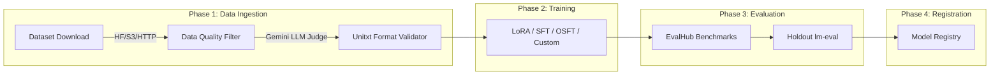
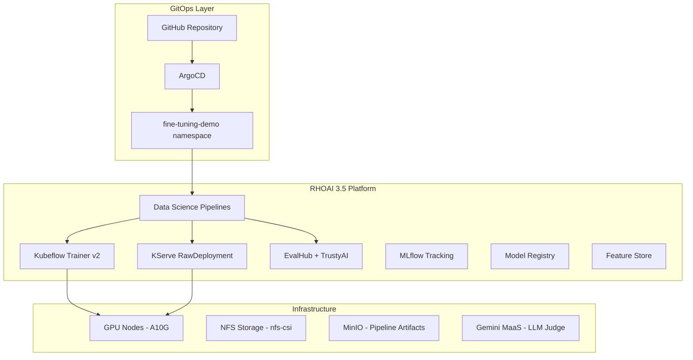
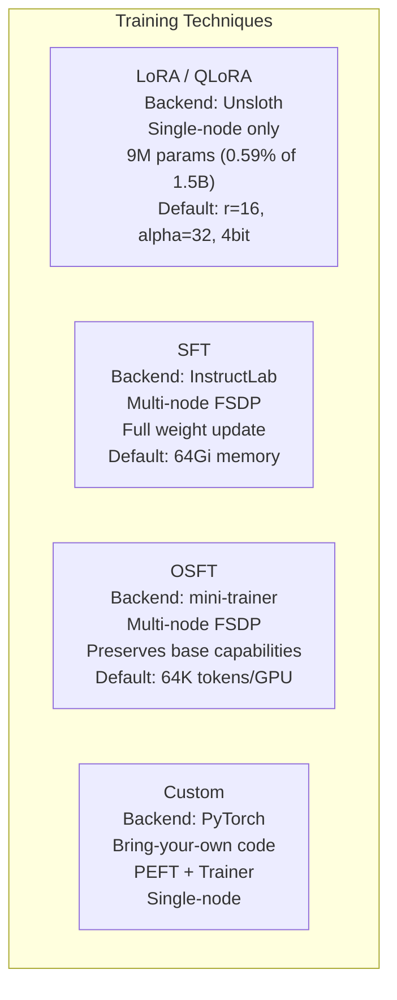
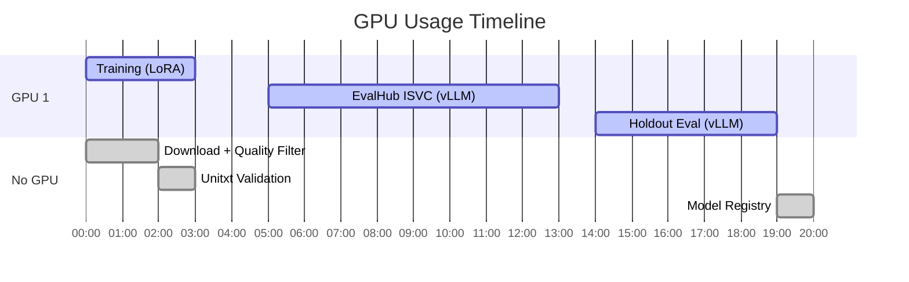

# Fine-Tuning Pipeline for Red Hat OpenShift AI 3.5

Production-grade, GitOps-deployed KFP pipeline for LLM fine-tuning with multiple techniques, automated evaluation, and model registry integration.

## Pipeline Overview



### What Each Phase Does

| Phase | Component | What It Does |
|-------|-----------|-------------|
| **1** | `dataset_download` | Pulls instruction-tuning data from HuggingFace, S3, or HTTP. Splits 90/10 for train/eval. |
| **1.5** | `data_quality_filter` | Deduplicates, quality-scores, and optionally runs an LLM judge (Gemini) for hallucination detection. Logs cleaned dataset to MLflow. |
| **2** | `unitxt_format_validator` | Enforces standard system prompt, validates chat template structure against base model tokenizer, checks token lengths. |
| **3** | `train_model` | Submits GPU training job via Kubeflow Trainer v2 + Training Hub. Supports LoRA, SFT, OSFT, and custom PyTorch. NFS-safe model merge. |
| **4a** | `evalhub_evaluator_kserve` | Deploys ephemeral KServe vLLM endpoint, runs EvalHub benchmarks (MMLU, TruthfulQA, Toxigen, etc.). |
| **4b** | `holdout_llm_evaluator` | Loads model with vLLM in-process, runs lm-eval on held-out 10% eval split + arc_easy benchmark. |
| **5** | `kubeflow_model_registry` | Registers model with full provenance: pipeline name, run ID, hyperparameters, eval scores, namespace. |

---

## Architecture



---

## Prerequisites

### Cluster Requirements

| Component | Version | Purpose |
|-----------|---------|---------|
| Red Hat OpenShift AI | 3.5 | Platform operator |
| Data Science Pipelines | KFP 2.16.1 | Pipeline orchestration |
| Kubeflow Trainer v2 | 2.1.0+ | Training job management |
| KServe | RawDeployment mode | Model serving for evaluation |
| TrustyAI + EvalHub | GA | Evaluation orchestration |
| MLflow | 3.14+ | Experiment tracking |
| Model Registry | 0.3.6+ | Model catalog |
| Sealed Secrets | Bitnami | Secret management |
| GPU Nodes | 2x NVIDIA A10G (22GB) | Training + evaluation |

### Required Secrets (SealedSecrets in `overlays/sandbox1388/fine-tuning-demo/`)

| Secret | Keys | Purpose |
|--------|------|---------|
| `kubernetes-credentials` | `KUBERNETES_SERVER_URL`, `KUBERNETES_AUTH_TOKEN` | Kubeflow Trainer API access |
| `hf-token` | `HF_TOKEN` | HuggingFace gated model download |
| `s3-secret` | `AWS_ACCESS_KEY_ID`, `AWS_SECRET_ACCESS_KEY` | S3 dataset access |
| `gemini-api-key` | `api-key` | Gemini MaaS for LLM judge |

### RBAC (Configured in `pipeline-rbac.yaml`)

| RoleBinding | Namespace | Grants |
|-------------|-----------|--------|
| `fine-tuning-pipeline-runner` | `fine-tuning-demo` | TrainJobs, KServe, EvalHub, ConfigMaps, Pods |
| `fine-tuning-pipeline-registry-access` | `rhoai-model-registries` | Services/endpoints for Model Registry |
| `fine-tuning-pipeline-mlflow-access` | `fine-tuning-demo` | MLflow experiments/datasets tracking |

### Namespace Labels

```yaml
labels:
  opendatahub.io/dashboard: "true"
  evalhub.trustyai.opendatahub.io/tenant: ""  # Required for EvalHub
```

---

## Directory Structure

```
fine-tuning-demo/
├── pipeline/
│   ├── finetuning_pipeline.py          # Pipeline definition (source of truth)
│   ├── finetuning_pipeline.yaml        # Compiled KFP YAML (auto-generated)
│   ├── build_pipeline.py               # Build script with post-compile patches
│   ├── pipeline-config.yaml            # Externalized config (versions, defaults)
│   └── local_components/
│       ├── train_model.py              # Unified training component (LoRA/SFT/OSFT/custom)
│       ├── data_quality_filter.py      # Dedup, quality scoring, LLM judge, MLflow tracking
│       ├── unitxt_formatter.py         # Prompt template validation + tokenization check
│       ├── evalhub_eval.py             # EvalHub with GPU tolerations (local fork)
│       ├── holdout_eval.py             # CUDA-capable holdout eval (local fork)
│       ├── model_registry.py           # TLS-enabled registry (local fork)
│       └── shared/
│           ├── techniques/             # LoRA, SFT, OSFT, custom technique modules
│           ├── data.py, output.py      # Data utilities
│           ├── training.py, setup.py   # Training utilities
│           └── tests/                  # 132 unit tests
├── pipeline-rbac.yaml                  # All RBAC for pipeline execution
├── pipeline-cr.yaml                    # Pipeline CR (auto-generated)
├── pipeline-version-cr.yaml            # PipelineVersion CR (auto-generated)
├── namespace.yaml                      # Namespace with EvalHub tenant label
├── dspa.yaml                           # Data Science Pipelines Application
├── hardware-profile.yaml               # A10G GPU hardware profile
├── llm-inference-service.yaml          # vLLM serving for fine-tuned model
├── llm-inference-service-base.yaml     # Base model for A/B comparison
└── notebook/
    └── lora-sql-finetuning-demo.ipynb  # Interactive notebook demo
```

---

## How to Compile

```bash
# Install dependencies (one-time)
python3 -m venv .venv && source .venv/bin/activate
pip install kfp==2.16.1 kfp-kubernetes pyyaml

# Compile pipeline + apply post-compile patches + generate CRs
make pipeline

# Run unit tests
make test
```

The `make pipeline` command:
1. Compiles `finetuning_pipeline.py` → `finetuning_pipeline.yaml`
2. Applies post-compile patches from `pipeline-config.yaml`:
   - Eval image override (CUDA-capable for holdout eval)
   - Package version overrides (model-registry >=0.3.6)
3. Generates `pipeline-cr.yaml` and `pipeline-version-cr.yaml` for GitOps

---

## How to Deploy (GitOps)

```bash
# Commit and push
git add -A && git commit -m "Update pipeline" && git push

# ArgoCD syncs automatically. To force:
oc annotate applications.argoproj.io fine-tuning-demo \
  -n openshift-gitops argocd.argoproj.io/refresh=hard --overwrite
```

ArgoCD manages:
- Namespace + labels
- RBAC (pipeline-rbac.yaml)
- DSPA + pipeline CRs
- SealedSecrets → Secrets
- Inference services, workbench, hardware profiles

---

## How to Run a Pipeline

### From the RHOAI Dashboard

1. Navigate to **Data Science Pipelines** → **Pipelines** → `finetuning-pipeline`
2. Click **Create run**
3. Select version `v5`
4. Fill in parameters (see reference below)
5. Click **Create**

### From the KFP API

```bash
KFP_ROUTE="https://ds-pipeline-dspa-fine-tuning-demo.apps.<cluster>/v1"
TOKEN=$(oc whoami -t)

curl -X POST "$KFP_ROUTE/apis/v2beta1/runs" \
  -H "Authorization: Bearer $TOKEN" \
  -H "Content-Type: application/json" \
  -d '{
    "display_name": "my-run",
    "pipeline_version_reference": {
      "pipeline_id": "<pipeline-id>",
      "pipeline_version_id": "<version-id>"
    },
    "runtime_config": {
      "parameters": {
        "technique": "lora",
        "dataset_uri": "hf://HuggingFaceH4/no_robots",
        "dataset_subset": 1000,
        "base_model": "Qwen/Qwen2.5-1.5B-Instruct",
        "epochs": 1,
        "enable_llm_judge": true,
        "llm_judge_endpoint": "https://maas.<cluster>/gemini-external/gemini-3.5-flash-lite/v1",
        "llm_judge_model": "gemini-3.5-flash-lite",
        "evalhub_url": "https://evalhub.redhat-ods-applications.svc.cluster.local:8443",
        "registry_address": "fine-tuning-demo.rhoai-model-registries.svc.cluster.local"
      }
    }
  }'
```

---

## Parameter Reference

### Dataset Parameters

| Parameter | Default | Description |
|-----------|---------|-------------|
| `dataset_uri` | `hf://b-mc2/sql-create-context` | Dataset source (hf://, s3://, https://) |
| `dataset_subset` | 5000 | Limit to first N examples (0 = all) |
| `train_split_ratio` | 0.9 | Train/eval split (0.9 = 90% train, 10% eval) |

### Data Quality Parameters

| Parameter | Default | Description |
|-----------|---------|-------------|
| `similarity_threshold` | 0.85 | Near-dedup threshold (1.0 = skip near-dedup) |
| `enable_llm_judge` | false | Enable LLM-based quality scoring |
| `llm_judge_endpoint` | `""` | OpenAI-compatible endpoint for judge model |
| `llm_judge_model` | `"judge"` | Model name for judge API calls |
| `system_prompt` | `"You are a helpful assistant."` | Standard system prompt enforced on all examples |

### Training Parameters

| Parameter | Default | Description |
|-----------|---------|-------------|
| `technique` | `lora` | Training technique: `lora`, `sft`, `osft`, `custom` |
| `base_model` | `Qwen/Qwen2.5-1.5B-Instruct` | HuggingFace model ID |
| `epochs` | 2 | Number of training epochs |
| `learning_rate` | 0.0002 | Learning rate |
| `effective_batch_size` | 128 | Effective batch size per optimizer step |
| `max_seq_len` | 8192 | Maximum sequence length in tokens |
| `lora_r` | 16 | LoRA rank |
| `lora_alpha` | 32 | LoRA scaling factor |
| `lora_sample_packing` | true | Pack multiple samples (required with flash_attention) |
| `lora_flash_attention` | true | Enable flash attention |
| `lora_load_in_4bit` | true | Enable 4-bit QLoRA quantization |

### Evaluation Parameters

| Parameter | Default | Description |
|-----------|---------|-------------|
| `evalhub_url` | `""` | EvalHub API endpoint (empty = skip) |
| `eval_memory` | `32Gi` | Memory for EvalHub ISVC (use 16Gi for 30Gi nodes) |
| `holdout_eval_tasks` | `["arc_easy"]` | lm-eval benchmark tasks |
| `holdout_eval_limit` | 100 | Max examples per eval task |
| `holdout_enforce_eager` | true | Disable CUDA graphs in eval |

### Registry Parameters

| Parameter | Default | Description |
|-----------|---------|-------------|
| `registry_address` | `""` | Model Registry address (empty = skip) |
| `registry_port` | 8443 | Registry port (TLS) |
| `registry_model_name` | `finetuned-model` | Name in registry |
| `registry_model_version` | `1.0.0` | Semantic version |

---

## Supported Techniques

All four techniques share the same 7-phase pipeline. Switch at runtime with the `technique` parameter — no recompilation or pipeline changes needed.



### Technique Details

| Technique | Backend | Multi-node | Validated | Recommended Parameters |
|-----------|---------|------------|-----------|----------------------|
| **LoRA / QLoRA** | Unsloth | Single-node | ✅ End-to-end | `memory_per_worker=32Gi`, `cpu_per_worker=4` |
| **SFT** | InstructLab | Multi-node (FSDP) | ✅ Unit tested | `memory_per_worker=64Gi`, `cpu_per_worker=4` |
| **OSFT** | mini-trainer | Multi-node (FSDP) | ✅ Unit tested | `memory_per_worker=64Gi`, `cpu_per_worker=8` |
| **Custom** | PyTorch / PEFT | Single-node | ✅ Unit tested | `memory_per_worker=32Gi`, `cpu_per_worker=4` |

All techniques use the same NFS-safe output pattern, evaluation pipeline, and model registry integration. The dispatch logic in `train_model.py` routes to technique-specific modules under `shared/techniques/`, each implementing `build_params()`, `train_func()`, and `log_metrics()`.

### Quick Start for Each Technique

```bash
# LoRA (fastest, parameter-efficient)
technique=lora, epochs=2, lora_r=16, lora_alpha=32, lora_load_in_4bit=true

# SFT (full weight update, distributed)
technique=sft, epochs=1, memory_per_worker=64Gi, sft_fsdp_sharding=FULL_SHARD

# OSFT (preserves base capabilities)
technique=osft, epochs=1, memory_per_worker=64Gi, cpu_per_worker=8, osft_unfreeze_ratio=0.25

# Custom (bring-your-own PyTorch code)
technique=custom, epochs=1, memory_per_worker=32Gi
```

---

## GPU Planning

The pipeline requires GPUs at different phases. With Gemini as the LLM judge, only local GPU phases need scheduling:



**Minimum: 2 GPU nodes** (1 GPU each). Phases are sequential — no overlap.

---

## Local Component Forks

Three upstream `pipelines-components` components are forked locally to fix cluster-specific issues. Upstream PRs have been submitted for all three:

| Component | Issue | Fix | Upstream PR |
|-----------|-------|-----|-------------|
| `evalhub_eval.py` | No GPU tolerations on ISVC | Added `tolerations` + `nodeSelector` to predictor spec | [#180](https://github.com/red-hat-data-services/pipelines-components/pull/180) |
| `model_registry.py` | Hardcoded `is_secure=False` | Added `is_secure` parameter + `https://` scheme | [#181](https://github.com/red-hat-data-services/pipelines-components/pull/181) |
| `holdout_eval.py` | `ubi9/python-311` has no CUDA toolkit | Added `enforce_eager` param + vLLM env vars | [#182](https://github.com/red-hat-data-services/pipelines-components/pull/182) |

Once upstream PRs are merged, the local forks can be replaced with the upstream components.

---

## Post-Compile Patches

`build_pipeline.py` applies patches after KFP compilation to fix upstream component issues without forking:

| Patch | What | Why |
|-------|------|-----|
| Eval image override | `ubi9/python-311` → CUDA training-hub image | Holdout eval needs nvcc for vLLM JIT |
| model-registry version | `==0.3.4` → `>=0.3.6` | 0.3.4 removed from PyPI |

Configured in `pipeline-config.yaml` under `post_compile_patches`.

---

## Troubleshooting

### EvalHub ISVC stays Pending

**Symptom:** `PredictorReady=False(MinimumReplicasUnavailable)` for 600s

**Causes:**
- GPU nodes have taints — ISVC needs matching tolerations (fixed in local fork)
- Memory request too high — use `eval_memory: "16Gi"` for 30Gi nodes
- No free GPU — ensure judge model is on Gemini (not local GPU)

### MinIO storage full

**Symptom:** `XMinioStorageFull: Storage backend has reached its minimum free drive threshold`

**Fix:** Clean old run artifacts:
```bash
oc exec deploy/minio-dspa -n fine-tuning-demo -- sh -c 'rm -rf /data/mlpipeline/finetuning-pipeline/*/'
```

### NFS mmap hang during model merge

**Symptom:** Training pod in D (disk sleep) state during `save_pretrained_merged`

**Fix:** Already fixed — LoRA merge writes to `/tmp` first, then copies to NFS PVC.

### EvalHub 403 Forbidden

**Symptom:** `Forbidden (user=system:serviceaccount:fine-tuning-demo:pipeline-runner-dspa)`

**Fix:** Ensure namespace has `evalhub.trustyai.opendatahub.io/tenant=""` label and pipeline SA has EvalHub RBAC.

### Model Registry HTTP/HTTPS mismatch

**Symptom:** `Client sent an HTTP request to an HTTPS server`

**Fix:** Already fixed in local fork — `is_secure=True` with `https://` scheme.

---

## Testing

```bash
# Run all 132 unit tests
make test

# Tests cover:
# - All 4 technique modules (LoRA, SFT, OSFT, custom) — build_params, dispatch, defaults
# - Flash attention / sample_packing safety guard
# - QLoRA mutual exclusion
# - Data utilities (resolve, prepare, OCI download)
# - Output utilities (find_model_dir, persist, loss charts)
# - Training utilities (compute_nproc, wait_for_job)
# - Setup utilities (K8s client, env config, HF token)
```

---

## Demo Coverage

| Requirement | Pipeline Phase | Status |
|-------------|---------------|--------|
| 1. Select & cleanse dataset | Phase 1 + 1.5 (Gemini LLM judge) | ✅ Demonstrated |
| 2. Select base model | `base_model` parameter | ✅ Demonstrated |
| 3. Tokenization & formatting | Phase 2 (unitxt validator) | ✅ Demonstrated |
| 4. Multi-technique fine-tuning | Phase 3 — LoRA, SFT, OSFT, Custom (single `technique` param) | ✅ Demonstrated |
| 5. Distributed training | Kubeflow Trainer v2 + FSDP (SFT/OSFT) | ✅ Supported |
| 6. Pipeline triggers | Scheduled runs via RHOAI Dashboard or KFP API | ✅ Supported |
| 7. Serve for evaluation | Phase 4a (KServe vLLM via EvalHub) | ✅ Demonstrated |
| 8. LMEval + results | Phase 4a + 4b (EvalHub benchmarks + lm-eval holdout) | ✅ Demonstrated |
| 9. Compare results | MLflow Experiments comparison UI (Develop & train → Experiments → Compare) | ✅ Demonstrated |
| 10. Model Registry | Phase 5 (full provenance, hyperparams, eval scores) | ✅ Demonstrated |

---

## Adding a New Technique

The pipeline is designed to be extensible. To add a new technique:

1. Create a module in `local_components/shared/techniques/my_technique.py`
2. Export the required interface:

```python
ALGORITHM_NAME = "SFT"            # TrainingHubAlgorithms enum name
IS_SINGLE_NODE = False            # True = force num_workers=1
DEFAULT_LR = 5e-6                 # Default learning rate
DEFAULT_EPOCHS = 1                # Default epoch count
METRICS_FILES = []                # Metric JSONL filenames to look for

def build_params(common, **kw):   # Add technique-specific params
def train_func(**p):              # Serialized to run inside TrainJob pod
def log_metrics(output, params):  # Log technique-specific KFP metrics
```

3. Register it in `shared/techniques/__init__.py` (add to `SUPPORTED_TECHNIQUES` and the import block)
4. Add technique-specific parameters to `finetuning_pipeline.py` if needed
5. Recompile with `make pipeline`
