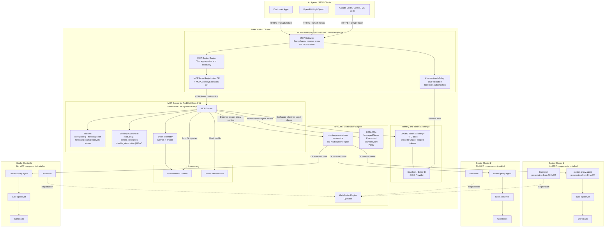

# Architecture Diagrams

---

## RFP Agent — End-to-End Architecture

The RFP Agent is a Hermes-based AI agent deployed on OpenShift via an AgentHive Sandbox CRD. It uses an 8-skill orchestrated pipeline to process RFP/RFI documents, backed by Gemini 2.5 Pro and RAG retrieval through an OGX (Llama Stack) server with a Milvus vector database.

### System Architecture

Shows all layers: user access, OpenShift ingress, Hermes agent runtime, skill orchestration (8 skills), RAG pipeline, knowledge corpus (33 docs), sandbox security (OpenShell + OPA), evaluation framework (RAGAS + MLflow), and GitOps delivery (ArgoCD + Kustomize).

- Source: [`rfp-agent-architecture.mmd`](rfp-agent-architecture.mmd)
- Rendered: [`rfp-agent-architecture.png`](rfp-agent-architecture.png)

### Skill Pipeline Sequence

Shows the end-to-end RFP processing workflow as a sequence diagram: intake (classify documents) -> analysis (extract requirements) -> strategy (gap analysis via RAG) -> drafting (generate response sections) -> accuracy review (claim-by-claim verification) -> final review (completeness checklist) -> export (DOCX/PDF delivery).

- Source: [`rfp-agent-skill-pipeline.mmd`](rfp-agent-skill-pipeline.mmd)
- Rendered: [`rfp-agent-skill-pipeline.png`](rfp-agent-skill-pipeline.png)

### Rendering

```bash
cd diagrams
npm install
./node_modules/.bin/mmdc -i rfp-agent-architecture.mmd -o rfp-agent-architecture.png -w 2800 -H 3600 -b transparent -s 2
./node_modules/.bin/mmdc -i rfp-agent-skill-pipeline.mmd -o rfp-agent-skill-pipeline.png -w 2800 -H 4800 -b transparent -s 2
```

---

## MCP + RHACM Hub-and-Spoke Architecture

## Architecture Diagram



## Key Points

| Layer | Hub Cluster | Spoke Clusters |
|-------|-------------|----------------|
| Agent Traffic | MCP Gateway (auth, rate limit, tool filtering) | Nothing |
| MCP Logic | MCP Server (tools, config, RBAC) | Nothing |
| Identity | Keycloak / Entra ID + Token Exchange | Nothing |
| Cluster Mgmt | RHACM + MCE + Cluster-Proxy (server) | Klusterlet + Cluster-Proxy agent (pre-existing) |
| Observability | Prometheus, Thanos, OpenTelemetry | Nothing new |

## References

- [MCP Server for OpenShift - OCP 4.22 Docs](https://docs.redhat.com/en/documentation/openshift_container_platform/4.22/html/ai_applications/mcp-server)
- [MCP Gateway Install - Connectivity Link 1.3](https://docs.redhat.com/en/documentation/red_hat_connectivity_link/1.3/html/installing_the_mcp_gateway/mcp-gateway-install)
- [OpenShift MCP Server GitHub](https://github.com/openshift/openshift-mcp-server)
- [MCP Server Blog Post](https://www.redhat.com/en/blog/model-context-protocol-server-red-hat-openshift-now-available-technology-preview)
