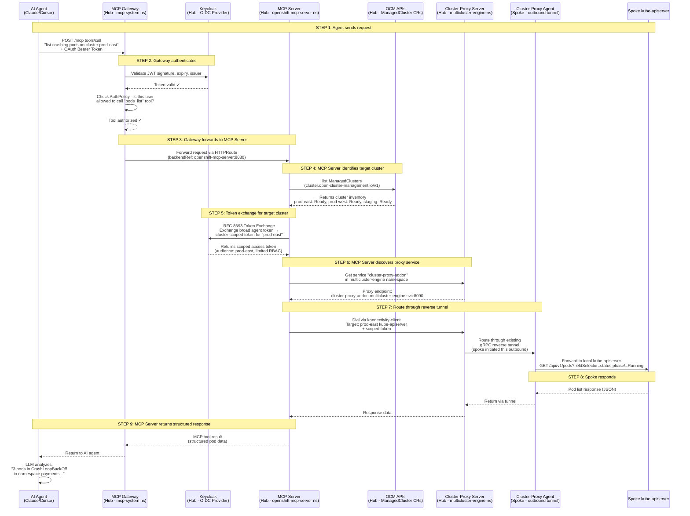

# How One MCP Server on Hub Talks to Multiple Spoke Clusters

## Technical Flow Explanation

### The Core Concept

The MCP server does NOT connect directly to spoke clusters. It uses RHACM's **cluster-proxy addon** — a reverse proxy tunnel based on Kubernetes' `apiserver-network-proxy` (konnectivity). Each spoke already maintains a persistent outbound gRPC tunnel back to the hub. The MCP server routes requests through those existing tunnels.

---

## Flow Diagram

---

## Bullet Point Flow

### Step 1 — Agent Sends Request
- AI agent (Claude Code, Cursor, etc.) sends MCP tool call to the gateway
- Example: "list all crashing pods on cluster prod-east"
- Request includes an OAuth bearer token from Keycloak/Entra ID

### Step 2 — Gateway Authenticates & Authorizes
- MCP Gateway validates the JWT token (signature, expiry, issuer)
- Kuadrant AuthPolicy checks: is this user allowed to call `pods_list`?
- If unauthorized → 403 Forbidden, request never reaches MCP server
- If authorized → forwards to MCP server

### Step 3 — Gateway Forwards to MCP Server
- Gateway uses the HTTPRoute (in-cluster service reference)
- Routes to `openshift-mcp-server:8080` on the same hub cluster
- This is a local in-cluster hop, not a network call to a remote cluster

### Step 4 — MCP Server Identifies Target Cluster
- MCP server queries `ManagedCluster` CRs on the hub via OCM APIs
- These CRs are maintained by RHACM — every imported cluster has one
- Server finds "prod-east" in the cluster inventory
- No kubeconfig needed — just the cluster name from the CRs

### Step 5 — Token Exchange (RFC 8693)
- MCP server exchanges the agent's broad token for a **cluster-scoped token**
- Calls Keycloak's token exchange endpoint
- Gets back a narrowly-scoped token: audience=prod-east, limited RBAC
- This prevents lateral movement — token only works on the target cluster

### Step 6 — Discover the Proxy Tunnel Endpoint
- MCP server looks up the `cluster-proxy-addon` service
- Located in the `multicluster-engine` namespace on the hub
- This is the hub-side endpoint of all reverse tunnels from spokes
- Endpoint: `cluster-proxy-addon.multicluster-engine.svc:8090`

### Step 7 — Route Through the Reverse Tunnel (THE KEY STEP)
- MCP server uses a **konnectivity client** to dial through the tunnel
- It tells the proxy server: "I want to reach prod-east's kube-apiserver"
- The proxy server finds prod-east's tunnel (already established by the spoke)
- Request flows: MCP Server → Proxy Server → gRPC tunnel → Proxy Agent on spoke → local kube-apiserver
- **The spoke initiated this tunnel outbound** — no inbound firewall rules needed on spoke

### Step 8 — Spoke Responds Normally
- Spoke's kube-apiserver receives a standard authenticated API request
- It validates the scoped token via RBAC (normal Kubernetes auth)
- It doesn't know the request came through a tunnel — it's transparent
- Returns pod list (or whatever was requested)
- Response flows back through the same tunnel

### Step 9 — MCP Server Returns to Agent
- MCP server packages the response as a structured MCP tool result
- Gateway passes it back to the AI agent
- LLM analyzes the data and presents findings to the user

---

## Why No MCP Components on Spokes

| Requirement | How it's satisfied | Deployed by whom? |
|-------------|-------------------|-------------------|
| Network tunnel to hub | cluster-proxy agent (outbound gRPC) | RHACM (automatic on import) |
| Cluster registration | Klusterlet | RHACM (automatic on import) |
| Serve API requests | kube-apiserver | OpenShift (always there) |
| MCP protocol handling | NOT needed on spoke | — |
| MCP gateway | NOT needed on spoke | — |
| Token validation | Standard K8s RBAC on spoke | OpenShift (always there) |

**Bottom line**: Everything the MCP server needs on the spoke is already deployed by RHACM when the cluster was first imported. Zero additional installation.

---

## VPN Analogy

- Hub = VPN concentrator
- Each spoke = VPN client that maintains a persistent tunnel home
- MCP server = application behind the concentrator that can reach any client
- The spoke doesn't know the MCP server exists — it just sees normal API requests arriving through its tunnel

---

## References

- [OCM Cluster Proxy Docs](https://open-cluster-management.io/docs/getting-started/integration/cluster-proxy/)
- [cluster-proxy GitHub](https://github.com/open-cluster-management-io/cluster-proxy)
- [OCP 4.22 MCP Server Docs](https://docs.redhat.com/en/documentation/openshift_container_platform/4.22/html/ai_applications/mcp-server)
- [MCP Server Blog](https://www.redhat.com/en/blog/model-context-protocol-server-red-hat-openshift-now-available-technology-preview)
- [OCM Architecture](https://open-cluster-management.io/docs/concepts/architecture/)
